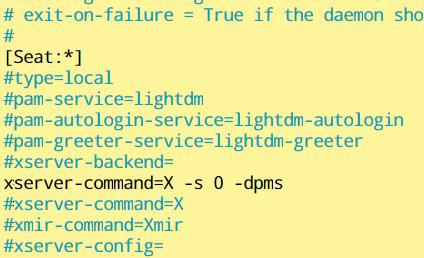

# RaspberryPi-MagicMirror

## 环境配置

### 树莓派系统安装
1. 官网下载系统镜像解压,通过balenaEtcher烧写到内存卡上.
2. 直接在内存卡中创建无后缀文件`ssh`以开启树莓派的ssh服务.
3. 修改config.txt,树莓派系统中路径为/boot/config.txt
    ```
    hdmi_force_hotplug=1    //开启树莓派HDMI输出热拔插
    config_hdmi_boost=4     ///开启树莓派HDMI输出信号增强
    ```
4. 连接输入输出设备,开机依据向导完成基础设置.

### 树莓派与笔记本的vnc连接
0. 树莓派ssh服务已打开.
1. 网线连接PC与树莓派.
2. 通过cmd获取树莓派ip.
    ```
    ping raspberrypi
    ```
3. 以获取的树莓派ip地址通过PC的ssh客户端连接,默认端口22.用户名pi,密码raspberry.
4. 打开树莓派的vnc服务并且获取服务端口.
    ```
    sudo vncserver
    ```
5. 用PC上的vncviewer以指定`ip:port`以打开桌面.
6. 桌面界面打开终端`sudo raspi-config`打开设置,选择`5.interfacing options`设置开机启动ssh与vnc.

### 设置开机自动连接WiFi.
1. 打开WiFi设置.
    ```
    sudo nano /etc/wpa_supplicant/wpa_supplicant.conf
    ```
2. 添加如下文本
    ```
    network={
            ssid="你的WiFi名称"
            psk="你的WiFi密码"
            key_mgmt=WPA-PSK        //加密方式
            priority=5
    }
    ```
    重启生效.

### 安装Hybrid字体
1. 下载字体.
    ```
    git clone https://github.com/dodd97/RaspberryPi-MagicMirror/YaHei-Consolas-Hybrid-1.12
    ```
2. 新建字体文件夹并且拷贝字体文件到字体文件夹下
    ```
    sudo mkdir /usr/share/fonts/truetype/myfonts
    sudo cp *.ttf  /usr/share/fonts/truetype/myfonts/
    ```
3. 更改字体文件夹与字体文件权限
    ```
    sudo chmod -c 777 /usr/share/fonts/truetype/myfonts
    sudo chmode -c 777 /usr/share/fonts/truetype/myfonts/*
    ```
4. 安装字体与刷新字体缓存
    ```
    sudo mkfontscale
    sudo mkfontdir
    sudo fc-cache -fv
    ```
## 魔镜安装
### 魔镜系统安装
1.  系统清理与升级.
    ```
    sudo apt-get remove --purge idle3 java-common libreoffice* minecraft-pi scratch nuscratch penguinspuzzle python-minecraftpi python3-minecraftpi smartsim sonic-pi wolfram-engine
    sudo apt-get autoremove
    sudo apt-get updatesudo apt-get upgrade
    sudo rpi-update
    sudo reboot
    ```
2. 安装Node.js与cnpm.
    ```
    curl -sL https://deb.nodesource.com/setup_10.x | sudo -E bash -
    sudo apt install -y nodejs
    npm install -g cnpm --registry=https://registry.npm.taobao.org
    ```
3. 下载魔镜资源
    ```
    git clone https://github.com/MichMich/MagicMirror
    ```
4. RaspbianBuster，需要升级Electron
    ```
    cnpm install electron@6.0.12
    ```
5. 安装魔镜系统
    ```
    cnpm MagicMirror/install
    ```

### 配置文件编写
1. 修改基础配置文件:
    ```
    sudo nano MagicMirror/config/config.js
    ```
2. 修改问候语模块配置文件:
    ```
    sudo nano MagicMirror/modules/default/compliments/compliments.js
    ```
3. 设置显示器垂直显示:
    ```
    sudo nano /boot/config.txt
    在最后添加
    # Rotate display vertically
    display_rotate=1
    ```
4. 禁止屏保和锁屏:
    ```
    sudo nano /etc/xdg/lxsession/LXDE-pi/autostart
    ```
    在最后添加
    ```
    @xset s noblank
    @xset s off
    @xset -dpms
    ```
    保存退出
    ```
    sudo nano /etc/lightdm/lightdm.conf
    ```
    在[Seat:*]部分添加`xserver-command=X -s 0 -dpms`
    
    
    
5. 关闭省电模式,防止WiFi自动断联
    ```
    sudo iw dev wlan0 set power_save off
    ```

### 启动魔镜
1. 重启
2. 启动    
    ```
    cd MagicMirror/
    cnpm start 
    ```
3. 退出:Alt打开状态栏退出.


 

